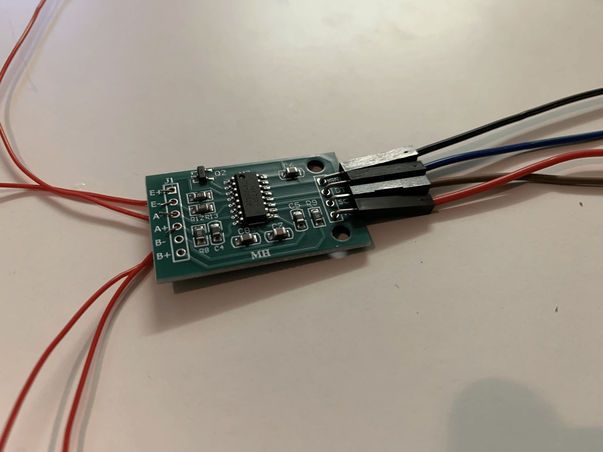
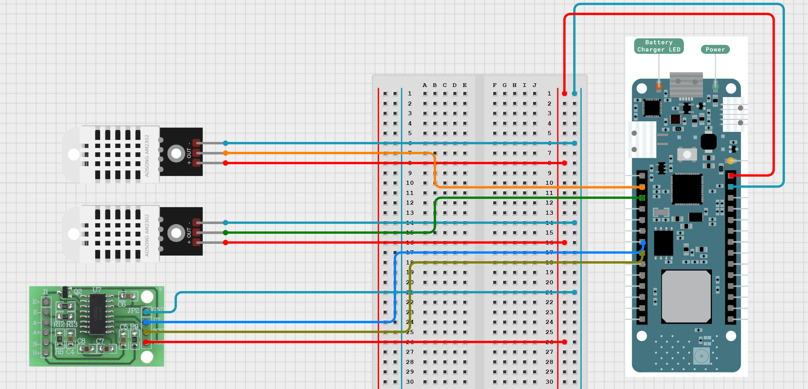
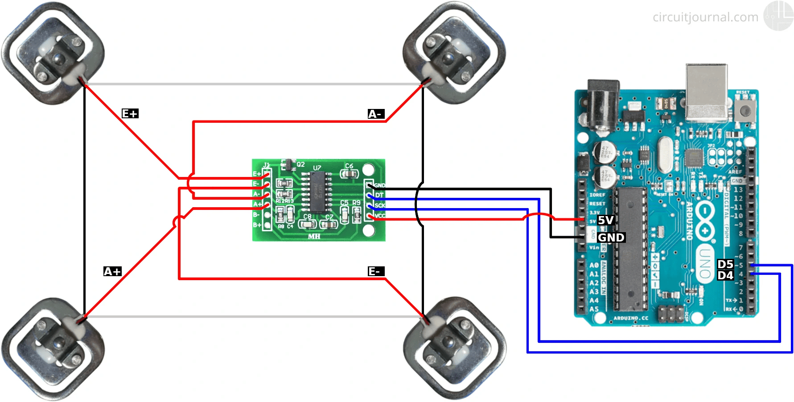
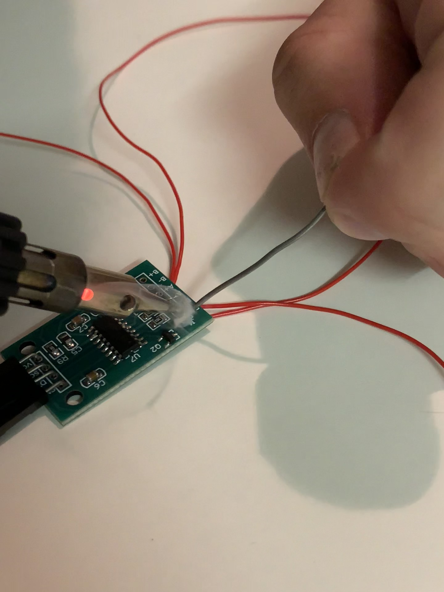
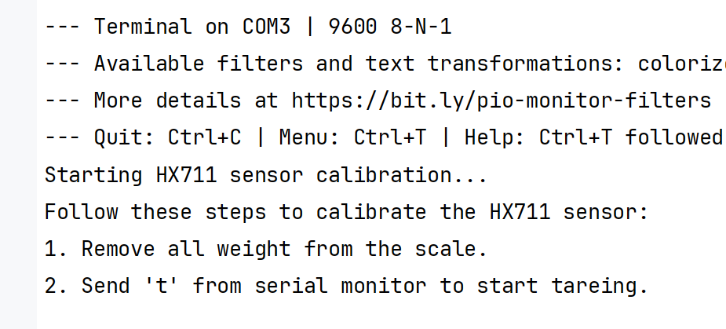
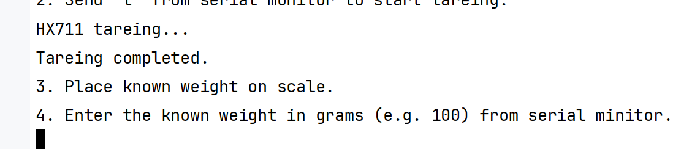
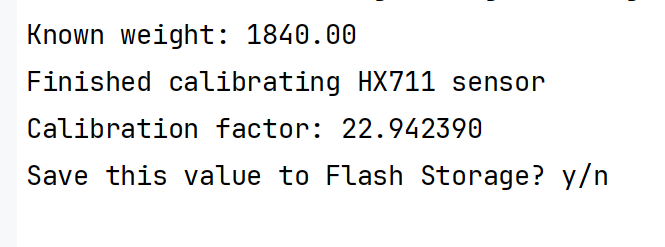
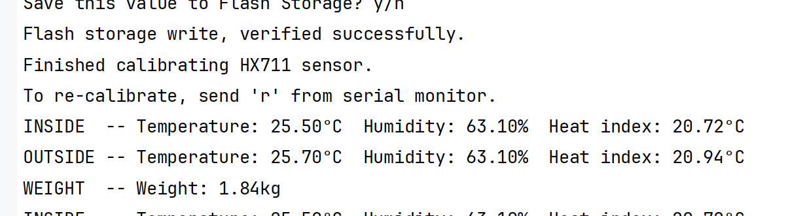
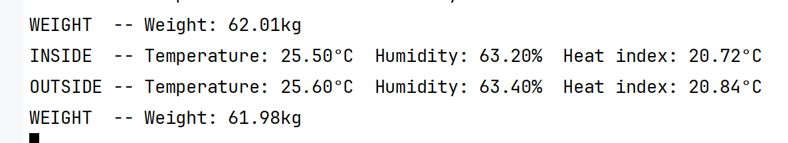
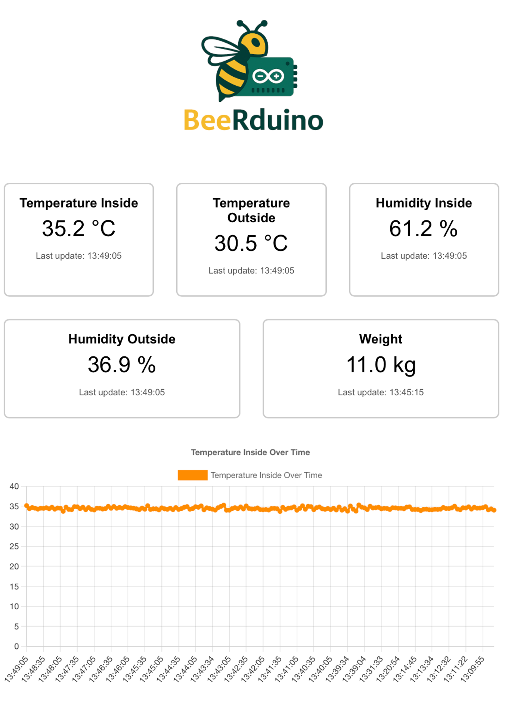

# BeeRduino Projektdokumentation

<div align="center">
  
</div>

## Autoren
- Daniel Hametner
- Christopher Nobis

## 1. Problembeschreibung

Die traditionelle Imkerei steht vor großen Herausforderungen bei der Überwachung der Bienenvölker. Wichtige Umweltparameter wie Temperatur, Luftfeuchtigkeit und Gewicht der Bienenstöcke werden häufig manuell, unregelmäßig oder gar nicht erfasst. Dies erschwert die rechtzeitige Erkennung von Problemen wie Krankheiten, Schädlingen oder Umwelteinflüssen, die die Gesundheit der Bienen negativ beeinflussen können. Die Folge sind nicht nur wirtschaftliche Verluste für Imkerinnen und Imker, sondern auch eine Bedrohung des Ökosystems.

Daher besteht ein Bedarf an einer automatisierten und verlässlichen Lösung zur kontinuierlichen Überwachung von Bienenstöcken in Echtzeit.

---

## 2. Lösungsansatz

### 2.1 Systemüberblick

BeeRduino ist ein intelligentes Monitoring-System für Bienenstöcke, das auf moderner Sensorik und einer Cloud-nativen Microservice-Architektur basiert. Unser Ziel war es, eine ganzheitliche Lösung zu schaffen, die von der Datenerfassung direkt am Bienenstock bis zur intuitiven Visualisierung der Messwerte reicht.

Das System besteht aus drei Kernkomponenten:

<div align="center">
  
</div>

- **Arduino-Firmware**: Erfasst regelmäßig Sensordaten (Temperatur, Luftfeuchtigkeit, Gewicht) über Sensoren wie den DHT22 und eine Wägesensorplattform (HX711). Die Daten werden drahtlos an das Backend gesendet.

- **Backend-Microservices**: Verarbeiten und speichern die Sensordaten. Sie empfangen die Messwerte via Gateway, verteilen sie über RabbitMQ, speichern sie in Datenbanken und stellen sie über eine GraphQL-API für Abfragen und Live-Updates bereit.

- **Frontend-Webanwendung**: Realisiert mit React und Apollo Client, visualisiert Messdaten in Echtzeit und historisch über interaktive Zeitreihendiagramme (Chart.js). Sie bietet eine intuitive Oberfläche für Imker, um jederzeit den Zustand ihrer Bienenvölker im Blick zu behalten.

---

## 3. Implementierung

### 3.1 Hardware und Sensorik

Für die Datenerfassung setzen wir auf bewährte Komponenten, die zuverlässig und stromsparend sind. Zentraler Mikrocontroller ist ein **Arduino MKR WAN 1310**, basierend auf dem SAMD21 Cortex-M0+ 32-bit ARM-Prozessor. Dieser verfügt über ein integriertes LoRa-Funkmodul, um in späteren Ausbaustufen auch lange Funkreichweiten zu ermöglichen.

Für die Umweltmessung nutzen wir zwei **DHT22** Sensor-Boards (jeweils innen und außen am Bienenstock), die Temperatur und Luftfeuchtigkeit erfassen. Die Sensoren sind als kleine Breakout-Boards montiert und bieten einen digitalen Datenausgang, der direkt mit dem Arduino verbunden ist.

Der Gewichtssensor besteht aus vier einzelnen Load Cells (Dehnungsmessstreifen), die mechanisch an den Ecken einer stabilen Plattform montiert sind. Elektrisch sind sie zu einer Wheatstone-Brücke verschaltet. Diese wird an einen **HX711**-Messverstärker angeschlossen, der das analoge Signal verstärkt, digitalisiert und an den Arduino überträgt.

<div align="center">
  
</div>

Auf diesem Bild sieht man die Waageplatte mit den vier an den Ecken befestigten Load Cells. Die dünnen Drähte führen zum HX711-Messverstärker.

<div align="center">
  
</div>

Hier ist das HX711-Modul zu sehen, ein präziser 24-Bit-Messverstärker für digitale Wägetechnik. An den linken Anschlussleisten (E+, E−, A+, A−) werden die Load Cells in Brückenschaltung angeschlossen. Auf der rechten Seite befinden sich die vier Pins zur Verbindung mit dem Arduino: VCC (Stromversorgung), GND (Masse), DT (Datenleitung) und SCK (Takt).

<div align="center">
  
</div>

Das Schaltbild zeigt, wie die vier Load Cells zu einer Wheatstone-Brücke verschaltet und an den HX711 angeschlossen sind. Der HX711 verstärkt das resultierende Differenzsignal und wandelt es in digitale Werte um, die der Arduino auslesen kann.

<div align="center">
  
</div>

Hier sieht man die Verdrahtung von vier Load Cells, die gemeinsam eine Wheatstone-Brücke bilden. Die kombinierten Signale werden an den HX711-Messverstärker weitergeleitet. Der HX711 überträgt die Messdaten über zwei digitale Leitungen (DT für Daten, SCK für Takt) an den Arduino. Zusätzlich erfolgt die Spannungsversorgung über VCC und GND.

### 3.2 Lötarbeiten und Montage

Eine wichtige Phase der Implementierung war das Löten der feinen Drähte an die Lastsensoren und den HX711-Verstärker. Aufgrund der geringen Größe der Bauteile und der Drahtstärke erfordert dies sorgfältiges Arbeiten und gutes Equipment.

<div align="center">
  
</div>

---

### 3.3 Arduino Firmware

Die Firmware auf dem Arduino MKR WAN 1310 ist in C++ geschrieben. Sie übernimmt das zyklische Auslesen der Sensoren und die optionale Datenübertragung per LoRaWAN. Die Ausführung erfolgt über die klassische `setup()`/`loop()`-Struktur von Arduino.

#### Aufbau und Sensorintegration

- **DHT22 (innen/außen)**\
  Zwei digitale Sensoren zur Messung von Temperatur und Luftfeuchtigkeit sind an den Pins `A0` (innen) und `A1` (außen) angeschlossen. Die Werte werden zusätzlich als Heat Index berechnet.

- **HX711 mit Load Cells**\
  Vier Dehnungsmessstreifen sind über einen HX711-Messverstärker mit dem Arduino verbunden. Der HX711 verwendet die Pins `A5` (DATA) und `A6` (CLOCK). Die Werte werden als Gewicht in Gramm oder Kilogramm ausgegeben.

#### Datenverarbeitung

Alle 500 ms wird geprüft, ob neue Sensorwerte erfasst werden sollen. Dabei werden folgende Schritte durchgeführt:

1. Temperatur und Luftfeuchtigkeit innen/außen messen
2. Heat Index für beide Positionen berechnen
3. Gewicht über HX711 auslesen
4. Serielle Ausgabe der Messwerte
5. (optional) Senden der Daten über LoRa

Bei fehlgeschlagenen Ablesungen (`NaN`) wird der Messzyklus abgebrochen.

#### Serielle Konsole

Über die serielle Schnittstelle (9600 Baud) sind zwei Kommandos verfügbar:

- `t` – startet Tare-Vorgang (Nullstellung) des HX711
- `r` – startet geführte Kalibrierung mit bekanntem Gewicht (inkl. optionalem Speichern im Flash)

Die Firmware gibt kontinuierlich strukturierte Daten im Textformat aus, z. B.:

```
INSIDE	-- Temperature: 35.1°C  Humidity: 65.2%  Heat index: 38.3°C
OUTSIDE	-- Temperature: 27.4°C  Humidity: 52.0%  Heat index: 28.7°C
WEIGHT	-- Weight: 32.5 kg
```

#### Kalibrierung und Flash-Speicher

Der Kalibrierungsfaktor für den HX711 wird im EEPROM des Arduino gespeichert. Beim Start wird dieser Wert geladen und zur Berechnung verwendet. Die Kalibrierung erfolgt interaktiv über den seriellen Monitor. Die Speicherung erfolgt nur auf Bestätigung.

Die folgende Serie zeigt die schrittweise Kalibrierung des HX711 über den seriellen Monitor:

<div align="center">
  
</div>

Nach dem Start der Kalibrierung wird die Tare-Funktion ausgelöst, um die Waage bei leerer Plattform auf Null zu setzen.

<div align="center">
  
</div>

Dann wird ein bekanntes Gewicht aufgelegt und der Wert in Gramm eingegeben.

<div align="center">
  
</div>

Die Firmware berechnet nun den Kalibrierungsfaktor und fragt, ob dieser im Flash gespeichert werden soll.

<div align="center">
  
</div>

Ist die Kalibrierung abgeschlossen, beginnt die Ausgabe der Messdaten. Gewicht, Temperatur und Luftfeuchtigkeit werden alle 500 ms gemessen und ausgegeben.

<div align="center">
  
</div>

#### LoRaWAN (optional)

Die Firmware unterstützt LoRaWAN, wenn das Makro `LORAWAN` aktiviert ist. In diesem Fall wird alle 5 Sekunden ein Datenpaket mit folgenden Werten gesendet:

- Zeitstempel (`uint64_t`)
- Temperatur innen (`float`)
- Luftfeuchte innen (`float`)
- Temperatur außen (`float`)
- Luftfeuchte außen (`float`)
- Gewicht (`float`)

Das Format ist binär (28 Byte) und wird über den internen LoRa-Modem des MKR WAN 1310 gesendet. Die Verbindung erfolgt über OTAA mit App EUI und App Key aus der Datei `arduino_secrets.h`.

---

### 3.4 Backend-Microservices

Das Backend (`beehive-monitor`) besteht aus mehreren Microservices, die in Java mit Quarkus und Spring Boot implementiert sind:

- **Core-Service**: Verwaltung der Stammdaten der Bienenstöcke, Registrierung neuer Völker und zentrale Schnittstelle für Client-Anfragen.

- **Data-Collector-Service**: Empfängt Sensordaten vom Gateway über eine REST-Schnittstelle unter `/gateway/collector` (für Einzeldatensätze) bzw. `/gateway/collector/batch` (für mehrere Einträge). Die REST-Endpunkte akzeptieren JSON-Objekte im definierten `MeasurementJson`-Format. Nach erfolgreicher Validierung werden die Daten über einen RabbitMQ-Publisher asynchron an weitere Microservices weitergeleitet.

- **Data-Analysis-Service**: Speichert die Zeitreihen-Daten persistent in einer MariaDB-Datenbank, bietet Abfrage- und Echtzeit-Subscription-APIs via GraphQL.

- **Data-Producer-Service**: Dient als Bindeglied zwischen externen Datenquellen (z. B. dem Arduino via USB) und dem System. In der Demoumgebung übernimmt er das Einlesen der seriellen Messdaten, wandelt diese in JSON-Objekte um und sendet sie an das Gateway. Sollte die Netzwerkverbindung temporär ausfallen, speichert er die Messwerte lokal in einer kleinen H2-Datenbank. Sobald die Verbindung wiederhergestellt ist, werden die Daten automatisch nachgesendet. Der Service kann optional auch Dummy-Daten erzeugen, was sich beim Testen und Entwickeln als hilfreich erwiesen hat.

- **Gateway-Service**: Verbindet Data-Producers mit Data-Collector-Services, sorgt für Load Balancing und Health Checks, registriert sich und verwaltet dynamisch Service-Endpoints über Consul.

---

### 3.5 Frontend-Webanwendung

Das Frontend (`beehive-dashboard`) ist eine moderne, in **React** umgesetzte Single-Page-Webanwendung. Sie ermöglicht sowohl die Betrachtung historischer Zeitreihen als auch die Anzeige von Live-Messwerten in Echtzeit. Die Kommunikation mit dem Backend erfolgt über GraphQL, realisiert mit dem **Apollo Client**.

Für die Datenanbindung wird ein Split-Link verwendet, der je nach Operation zwischen einem HTTP- und einem WebSocket-Link unterscheidet:

- **Historische Daten** werden über den Endpunkt `/gateway/graphql/analysis` per GraphQL Query abgefragt.
- **Live-Daten** werden über den WebSocket-Endpunkt `/gateway/ws/analysis/` per Subscription empfangen.

Die beiden zentralen GraphQL-Operationen sind:

- `GetMeasurements`: Liefert Zeitreihendaten zu einem bestimmten Zeitraum.
- `OnNewMeasurement`: Liefert neue Einzelwerte für einen bestimmten Sensortyp in Echtzeit.

Sobald die Anwendung gestartet wird, ruft sie zunächst historische Daten für die letzten fünf Tage ab. Diese Daten werden aufbereitet, gruppiert und in einem internen Zustand abgelegt. Gleichzeitig werden für alle fünf unterstützten Sensortypen jeweils separate Subscriptions eingerichtet:

- Temperatur innen
- Temperatur außen
- Luftfeuchtigkeit innen
- Luftfeuchtigkeit außen
- Gewicht

Neue Datenpunkte aus diesen Subscriptions werden automatisch in die Zeitreihen eingefügt. Es wird dabei darauf geachtet, dass die Listen nicht zu groß werden: Ältere Einträge werden ab einer definierten Maximalanzahl entfernt. Zusätzlich werden die jeweils aktuellsten Messwerte separat gespeichert, um die Kachelanzeige mit Zeitstempeln zu ermöglichen.

Die grafische Darstellung erfolgt mit **Chart.js**, das in React über `react-chartjs-2` eingebunden ist. Jeder Sensor wird in einem eigenen Liniendiagramm angezeigt, wobei Farbe, Einheit und Beschriftung individuell konfiguriert sind. Die Zuordnung erfolgt über ein Mapping zwischen Backend- und Frontend-Sensortypen, z. B.:

- `"TEMPERATURE_INSIDE"` → `"sensor_temperature_inside"` → Label: „Temperature Inside“, Einheit: °C

Gewichtsdaten werden vor der Darstellung im Frontend von Gramm in Kilogramm umgerechnet.

Ein zentrales visuelles Element der Anwendung sind die **Live-Kacheln**, die den jeweils letzten Wert jedes Sensors anzeigen und den Zeitpunkt der letzten Aktualisierung mitliefern. Die Anwendung ist responsiv aufgebaut und funktioniert auf verschiedenen Bildschirmgrößen.

<div align="center">
  
</div>

---

## 4. Ergebnisse

- Ein funktionierender Prototyp für automatisierte Erfassung und Überwachung von Bienenstöcken wurde realisiert.
- Die intuitive Web-Oberfläche erlaubt das Monitoring in Echtzeit und die Analyse von Trends.
- Das System ist modular aufgebaut und kann leicht um weitere Sensoren oder Funktionen erweitert werden.
- Die Datenverarbeitung ist robust, da Messwerte bei Verbindungsproblemen zwischengespeichert und später automatisch nachgesendet werden.
- Als nächste Schritte planen wir die Testung des Live-Datenversand über LoRa für eine bessere Unterstützung für frisch besiedelte Bienenstöcke. Für diesen Zweck haben wir bewusst den Arduino MKR WAN 1310 beschafft, da er die nötige LoRa-Funktionalität bietet.

Am 27. Juni 2025 wurde die **technische Präsentation** erfolgreich durchgeführt. Dabei konnte der vollständige Funktionsumfang des Systems demonstriert werden.

Für die Live-Demo wurde als Substitution für einen echten Bienenstock eine Bierkiste verwendet. Diese Wahl beruhte auf zwei Gründen: Zum einen entspricht das Gewicht einer Bierkiste in etwa dem eines Bienenstocks, sodass die Lastsensoren realistische Messwerte liefern konnten. Zum anderen minimierte die Bierkiste das Risiko von Schäden, die bei einem lebenden Bienenvolk auftreten könnten. Zur Kalibrierung der Wägesensoren diente ein schweres Buch als Referenzgewicht.

<div align="center">
  
</div>

---

## 5. Fazit und Ausblick

BeeRduino zeigt, wie moderne IoT-Technologien in der Imkerei einen echten Mehrwert schaffen können. Unser Prototyp bietet Imkern eine zuverlässige Lösung zur Überwachung ihrer Bienenvölker, die frühzeitige Maßnahmen bei kritischen Zuständen ermöglicht.

In Zukunft möchten wir LoRa zur Datenübertragung nutzen, die Batterielaufzeit optimieren und eine automatisierte Anomalieerkennung implementieren. Auch eine mobile App ist angedacht, um die Bedienbarkeit weiter zu verbessern.

**Was wir gelernt haben**:

- Arduino-Entwicklung mit CLion und PlatformIO war deutlich angenehmer als die Standard-IDE.
- Beim Löten hilft nicht nur gutes Werkzeug: Man muss auch die richtigen Leute kennen, die wissen, wie es geht.
- Gewichtssensoren zu kalibrieren braucht stabile Referenzgewichte.
- Unser Backend macht das System skalierbar, aber der Aufwand zum Start der Gesamtanwendung ist nicht zu unterschätzen.
- Für spätere Projekte würden wir Logging und Fehleranalyse früher mitdenken.

---

*Diese Dokumentation wurde im Rahmen des Lehrveranstaltung **MUS2UE: Mobile und ubiquitäre Systeme (SE.ma VZ SS25)** an der **FH OÖ Campus Hagenberg** erstellt.*
